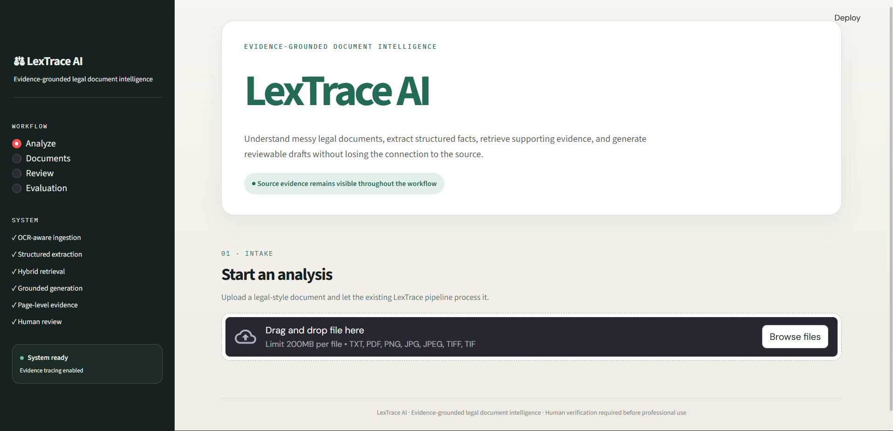
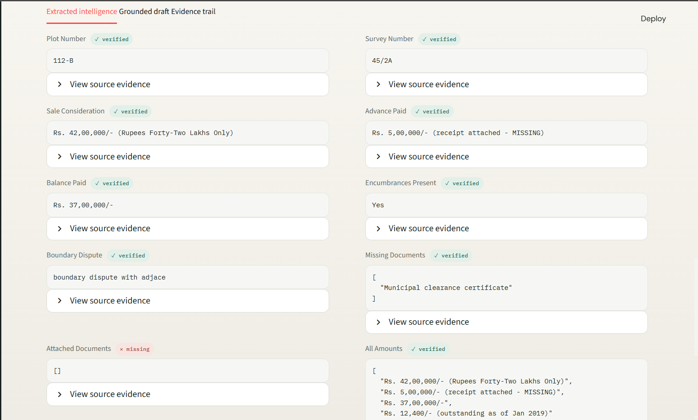
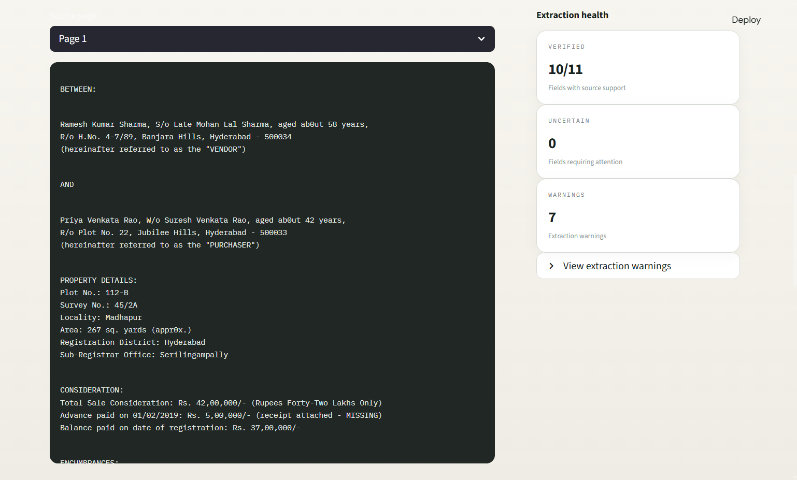

# LexTrace AI

> **Evidence-grounded legal document intelligence.**
>
> LexTrace AI processes messy legal documents, extracts structured
> information, retrieves supporting evidence using hybrid semantic +
> BM25 search, and generates source-grounded draft summaries with
> Gemini. Operator corrections can be captured and transformed into
> reusable generation rules that influence subsequent drafts.

**AI / NLP · Document Intelligence · RAG · OCR · Hybrid Retrieval ·
Gemini · Streamlit · Human-in-the-loop**

------------------------------------------------------------------------

## 🚀 Live Application

**[Open the Live Application](YOUR-LIVE-APPLICATION-URL)**

The deployed Streamlit application provides an interactive workflow for:

-   Uploading legal documents
-   Extracting structured information
-   Reviewing verified, uncertain, and missing fields
-   Inspecting source evidence and page references
-   Generating grounded drafts
-   Reviewing evidence trails
-   Inspecting evaluation information


------------------------------------------------------------------------

## 📸 Screenshots

### Document Intelligence Dashboard



### Extraction & Evidence Review



### Grounded Draft



> Store the screenshots in an `assets/` folder inside `LexTrace-AI/`
> using the filenames above. If you currently have only one screenshot,
> keep the dashboard image and add the other screenshots when available.

------------------------------------------------------------------------

## Overview

Legal documents are often difficult to process automatically because
they can contain inconsistent formatting, OCR errors, missing
information, damaged pages, ambiguous values, and unstructured narrative
text.

**LexTrace AI** is an end-to-end document intelligence pipeline designed
to address these challenges.

The system:

1.  Ingests and cleans document content
2.  Identifies document types and extracts structured legal fields
3.  Tracks field-level evidence and uncertainty
4.  Splits documents into page-aware passages
5.  Retrieves relevant evidence using **hybrid semantic + BM25
    retrieval**
6.  Generates grounded drafts using **Google Gemini**
7.  Links generated content back to source documents and pages
8.  Captures operator edits as reusable generation rules
9.  Provides evaluation and review artifacts

The goal is not to replace legal professionals, but to provide a
**traceable AI-assisted workflow where generated information can be
reviewed against its source evidence**.

------------------------------------------------------------------------

## Architecture

``` text
                         ┌─────────────────────┐
                         │   Document Input    │
                         │ PDF / Image / Text   │
                         └──────────┬──────────┘
                                    │
                                    ▼
                         ┌─────────────────────┐
                         │     INGESTION       │
                         │ Cleaning / OCR /    │
                         │ Metadata / Parsing  │
                         └──────────┬──────────┘
                                    │
                                    ▼
                         ┌─────────────────────┐
                         │  LEGAL EXTRACTION   │
                         │ Entities / Dates /  │
                         │ Parties / Amounts   │
                         └──────────┬──────────┘
                                    │
                       ┌────────────┴────────────┐
                       ▼                         ▼
              ┌─────────────────┐      ┌─────────────────┐
              │ Structured Data │      │ Source Evidence │
              │ + Confidence    │      │ Page / Excerpt  │
              └────────┬────────┘      └────────┬────────┘
                       │                         │
                       └────────────┬────────────┘
                                    ▼
                         ┌─────────────────────┐
                         │ HYBRID RETRIEVAL    │
                         │ Semantic + BM25     │
                         └──────────┬──────────┘
                                    │
                                    ▼
                         ┌─────────────────────┐
                         │ GROUNDED GENERATION │
                         │       Gemini        │
                         └──────────┬──────────┘
                                    │
                                    ▼
                         ┌─────────────────────┐
                         │ HUMAN REVIEW        │
                         │ Evidence / Draft    │
                         └──────────┬──────────┘
                                    │
                                    ▼
                         ┌─────────────────────┐
                         │ FEEDBACK / IMPROVE  │
                         │ Reusable rules      │
                         └──────────┬──────────┘
                                    │
                                    ▼
                         ┌─────────────────────┐
                         │    EVALUATION       │
                         └─────────────────────┘
```

See [`ARCHITECTURE.md`](ARCHITECTURE.md) for the detailed system design
and module-level decisions.

------------------------------------------------------------------------

## Key Features

### 📄 Document Ingestion

-   Document type detection
-   OCR/noise cleaning
-   Structured field extraction
-   Document metadata
-   Page-aware processing
-   Missing and uncertain information detection

### 🔎 Evidence-Grounded Retrieval

LexTrace AI uses a hybrid retrieval strategy combining:

-   **Semantic similarity** using `sentence-transformers`
-   **BM25 lexical retrieval**
-   Weighted score combination
-   Page-aware document chunks
-   Source-quality metadata

This allows retrieval to consider both **semantic meaning** and **exact
legal terminology**.

### 🧾 Field-Level Evidence

Extracted fields are not treated as equally reliable.

LexTrace AI tracks states such as:

``` text
VERIFIED
UNCERTAIN
MISSING
```

For supported fields, the system can associate the extracted value with:

``` text
Source document
Page number
Source excerpt
Evidence status
Reason for uncertainty
```

This is particularly useful for values affected by OCR noise, illegible
text, or damaged documents.

### 🤖 Grounded Generation

Drafts are generated using Google Gemini with retrieved source passages
and structured extraction context.

The generation pipeline is designed to:

-   Use retrieved evidence
-   Preserve source uncertainty
-   Avoid inventing missing values
-   Include source references
-   Distinguish extracted facts from uncertain information

### 👤 Human-in-the-Loop Improvement

Operator edits can be captured and analyzed to extract reusable
generation rules.

``` text
Operator edit
      ↓
Difference analysis
      ↓
Rule extraction
      ↓
Persistent improvement store
      ↓
Future generation prompts
```

Operator corrections can therefore influence **future drafting behavior
without requiring manual prompt changes for every iteration**.

### 📊 Evaluation

The project includes an evaluation framework covering areas such as:

-   Extraction
-   Retrieval
-   Grounding
-   Improvement behavior

Evaluation outputs are stored as development artifacts rather than being
presented as a universal production accuracy score.

------------------------------------------------------------------------

## Streamlit Application

LexTrace AI includes a Streamlit interface designed around the
document-review workflow.

The UI provides:

-   Document upload
-   Document intelligence overview
-   Extracted fields
-   Confidence and uncertainty indicators
-   Source evidence
-   Grounded drafts
-   Evidence trail
-   Review history
-   Evaluation information

The interface emphasizes **traceability and human verification** rather
than presenting generated text as authoritative legal advice.

------------------------------------------------------------------------

## Quick Start

### Prerequisites

-   Python 3.10+
-   Google Gemini API key

Create a Gemini API key through [Google AI
Studio](https://aistudio.google.com/).

### 1. Clone the repository

``` bash
git clone https://github.com/jethasriM/AI_Legal_Document_Intelligence_System.git
cd AI_Legal_Document_Intelligence_System/LexTrace-AI
```

### 2. Create a virtual environment

#### Windows

``` powershell
python -m venv venv
venv\Scripts\activate
```

#### macOS / Linux

``` bash
python3 -m venv venv
source venv/bin/activate
```

### 3. Install dependencies

``` bash
pip install -r requirements.txt
```

### 4. Configure Gemini

#### Windows PowerShell

``` powershell
$env:GEMINI_API_KEY="YOUR_API_KEY"
```

#### Windows CMD

``` cmd
set GEMINI_API_KEY=YOUR_API_KEY
```

#### macOS / Linux

``` bash
export GEMINI_API_KEY="YOUR_API_KEY"
```

------------------------------------------------------------------------

## Run the Pipeline

Process the sample documents:

``` bash
python src/pipeline.py --input samples/
```

Process a specific document:

``` bash
python src/pipeline.py --input samples/case_intake_003.txt
```

Run with the operator-improvement simulation:

``` bash
python src/pipeline.py --input samples/ --simulate-edit
```

### Available options

``` text
--input PATH
    File or directory to process

--simulate-edit
    Simulate operator edits and extract reusable improvement rules

--output-dir PATH
    Directory for generated outputs

--store PATH
    Path to the improvement-rule store

--quiet
    Reduce console output
```

------------------------------------------------------------------------

## Run the Streamlit Application

``` bash
streamlit run app.py
```

The application provides an interactive workflow for analyzing
documents, reviewing extracted information, inspecting evidence, and
viewing generated drafts.

------------------------------------------------------------------------

## Run Tests

``` bash
python tests/test_pipeline.py
```

------------------------------------------------------------------------

## Project Structure

``` text
AI_Legal_Document_Intelligence_System/
│
├── LexTrace-AI/
│   ├── app.py
│   │
│   ├── assets/
│   │   ├── lextrace-dashboard.png
│   │   ├── lextrace-extraction.png
│   │   └── lextrace-draft.png
│   │
│   ├── samples/
│   │   ├── case_intake_003.txt
│   │   ├── legal_notice_002.txt
│   │   └── title_deed_001.txt
│   │
│   ├── src/
│   │   ├── ingestion/
│   │   │   └── ingestion.py
│   │   ├── retrieval/
│   │   │   └── retrieval.py
│   │   ├── generation/
│   │   │   └── generation.py
│   │   ├── improvement/
│   │   │   └── improvement.py
│   │   ├── pipeline.py
│   │   └── evaluation.py
│   │
│   ├── tests/
│   │   └── test_pipeline.py
│   │
│   ├── README.md
│   ├── ARCHITECTURE.md
│   ├── ASSUMPTIONS_TRADEOFFS.md
│   ├── SAMPLE_INPUTS_OUTPUTS.md
│   └── requirements.txt
│
└── .gitignore
```

------------------------------------------------------------------------

## Technology Stack

  Layer                       Technology
  --------------------------- -----------------------
  Language                    Python
  UI                          Streamlit
  LLM                         Google Gemini
  LLM SDK                     `google-genai`
  Semantic Retrieval          Sentence Transformers
  Lexical Retrieval           BM25
  ML / Numerical Processing   NumPy, scikit-learn
  Document Processing         pypdf, Pillow
  Testing                     Python test suite
  Configuration               Environment variables

------------------------------------------------------------------------

## Retrieval Architecture

LexTrace AI combines semantic and lexical retrieval:

``` text
                    Query
                      │
             ┌────────┴────────┐
             ▼                 ▼
        Semantic Search      BM25
             │                 │
             └────────┬────────┘
                      ▼
              Weighted Ranking
                      │
                      ▼
             Relevant Passages
```

The current implementation uses a semantic/BM25 hybrid rather than
relying exclusively on either lexical or embedding-based retrieval.

The semantic retrieval component uses:

``` text
all-MiniLM-L6-v2
```

with hybrid weighting between semantic and BM25 scores.

------------------------------------------------------------------------

## Sample Documents

The repository includes synthetic documents designed to exercise
different document-processing challenges.

### `case_intake_003.txt`

Example characteristics:

-   Case metadata
-   Parties
-   Payment information
-   Missing documentation
-   Legal next steps

### `legal_notice_002.txt`

Example characteristics:

-   Rental dispute
-   Monetary dues
-   Alleged violations
-   Uncertain or illegible values
-   Multiple requested actions

### `title_deed_001.txt`

Example characteristics:

-   Property information
-   Sale consideration
-   Missing receipt
-   Boundary dispute
-   Municipal dues
-   Damaged or partial information

These examples allow the pipeline to demonstrate extraction, uncertainty
handling, retrieval, and grounded generation without exposing real
client information.

------------------------------------------------------------------------

## Output Artifacts

Running the pipeline generates artifacts under the configured output
directory.

### Extracted document JSON

``` text
*_extracted.json
```

Contains structured extraction information, confidence/uncertainty
flags, metadata, and source evidence.

### Generated drafts

``` text
*_draft.md
```

Human-readable generated draft output.

### Draft metadata

``` text
*_draft.json
```

Structured generation information and evidence/provenance data.

### Review records

``` text
*_edit.json
```

Records operator edits and extracted improvement rules when the
improvement workflow is used.

### Evaluation

``` text
evaluation_report.json
```

Development evaluation results and per-document information.

Runtime artifacts are excluded from version control.

------------------------------------------------------------------------

## Evidence and Traceability

A core design principle of LexTrace AI is:

> **A generated claim should be traceable to the evidence used to
> produce it.**

Retrieval passages contain source metadata such as:

``` text
Source document
Page number
Chunk number
Source quality
Passage text
```

Example citation:

``` text
[Source: legal_notice_002.txt, page 1, chunk 3]
```

This creates a traceability path:

``` text
Generated statement
       ↓
Retrieved evidence
       ↓
Original document
       ↓
Specific page / passage
```

------------------------------------------------------------------------

## Handling Uncertainty

Legal documents can contain information that cannot be reliably
recovered from the source.

LexTrace AI therefore distinguishes between:

``` text
Verified
   ↓
Evidence found and matched

Uncertain
   ↓
Possible OCR ambiguity / damaged / illegible content

Missing
   ↓
Expected information was not found
```

For example, an illegible electricity amount should not silently become
a fabricated number.

Instead, the system can surface the uncertainty and preserve the source
indication.

------------------------------------------------------------------------

## Evaluation Philosophy

The evaluation framework is intended as a **development-time measurement
tool**, not as a claim that the system achieves a universal
legal-document accuracy percentage.

The project evaluates multiple stages independently:

``` text
Extraction
    ↓
Retrieval
    ↓
Grounding
    ↓
Improvement
```

This makes it possible to identify where errors occur rather than
reducing the entire system to a single accuracy number.

------------------------------------------------------------------------

## Design Decisions

### Architecture

See [`ARCHITECTURE.md`](ARCHITECTURE.md) for:

-   System architecture
-   Module responsibilities
-   Data flow
-   Retrieval design
-   Generation flow
-   Evidence handling

### Assumptions & Tradeoffs

See [`ASSUMPTIONS_TRADEOFFS.md`](ASSUMPTIONS_TRADEOFFS.md) for:

-   Current assumptions
-   Engineering tradeoffs
-   Known limitations
-   Potential future improvements

### Sample Inputs & Outputs

See [`SAMPLE_INPUTS_OUTPUTS.md`](SAMPLE_INPUTS_OUTPUTS.md) for annotated
examples showing what each stage of the pipeline produces.

------------------------------------------------------------------------

## Limitations

The current implementation is a project/development system rather than a
production legal platform.

Known limitations include:

-   OCR quality depends on the quality of the source document
-   Legal-domain extraction is based on the implemented field patterns
    and rules
-   Retrieval quality depends on chunking and query formulation
-   Generated drafts depend on the selected Gemini model
-   Evaluation is currently based on the project's available test/sample
    data
-   Human verification is required before professional use

------------------------------------------------------------------------

## Future Improvements

Potential next steps include:

-   Production OCR integration for scanned PDFs
-   Better handwriting recognition
-   Layout-aware document parsing
-   Legal-domain embedding models
-   Retrieval reranking
-   Larger benchmark datasets
-   Automated citation verification
-   More comprehensive legal entity extraction
-   Human-review analytics
-   Larger-scale retrieval and generation evaluation
-   Containerized deployment
-   Authentication and document access controls
-   Secure document storage and access policies

------------------------------------------------------------------------

## Important Disclaimer

LexTrace AI is an **AI-assisted document intelligence and drafting
system**.

It does not provide legal advice, determine legal outcomes, or replace
review by a qualified legal professional.

Generated information should be verified against the original source
documents before professional use.

------------------------------------------------------------------------

## Author

**Jethasri Muvvala**

AI/ML Engineer · Software Developer

[GitHub](https://github.com/jethasriM)
